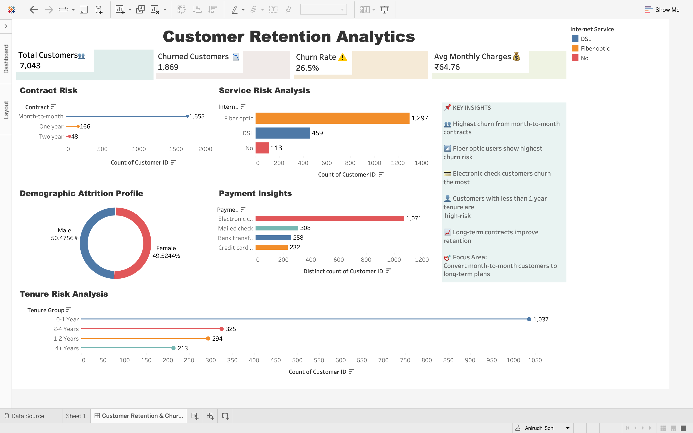

#  Customer Retention Analytics Dashboard

##  Project Overview
The **Customer Retention Analytics Dashboard** is an end-to-end Tableau analytics project designed to analyze customer churn behavior in the telecom industry.

This project focuses on identifying:
- High-risk customers
- Service-based churn trends
- Contract-related churn patterns
- Payment behavior insights
- Customer retention opportunities

The dashboard transforms raw telecom customer data into actionable business intelligence that can help organizations reduce churn and improve customer retention strategies.

---

#  Business Problem
Customer churn is one of the biggest challenges for telecom companies. Losing customers directly impacts:
- Revenue
- Customer acquisition cost
- Brand loyalty
- Long-term business growth

This project helps businesses:
✅ Detect churn patterns  
✅ Understand customer behavior  
✅ Improve retention strategies  
✅ Reduce revenue loss  

---

#  Key KPIs

| KPI | Value |
|---|---|
| Total Customers | 7,043 |
| Churned Customers | 1,869 |
| Churn Rate | 26.5% |
| Avg Monthly Charges | ₹64.76 |

---

#  Dashboard Insights

## 🔹 Contract Risk
- Month-to-month contracts show the highest churn rate.
- Long-term contracts improve customer retention significantly.

## 🔹 Service Risk Analysis
- Fiber optic users have the highest churn risk.
- DSL users show comparatively lower churn behavior.

## 🔹 Payment Insights
- Customers using electronic check payment methods churn the most.
- Auto-payment methods improve retention stability.

## 🔹 Demographic Attrition Profile
- Churn distribution between male and female customers is nearly equal.

## 🔹 Tenure Risk Analysis
- Customers with less than 1 year tenure are highly likely to churn.
- Customer loyalty increases with longer tenure duration.

---

#  Tools & Technologies Used

| Tool | Purpose |
|---|---|
| Tableau | Dashboard Development |
| Excel | Data Cleaning & Preparation |
| CSV Dataset | Telecom Customer Data |
| GitHub | Portfolio Hosting |

---

#  Files Included

| File | Description |
|---|---|
| `WA_Fn-UseC_-Telco-Customer-Churn.csv` | Telecom customer churn dataset |
| `ANI'SPROJECT10.twb` | Tableau workbook |
| `dashboard-preview.png` | Dashboard screenshot preview |

---

#  Dashboard Preview

---

#  Dashboard Features

✅ KPI Cards  
✅ Interactive Visualizations  
✅ Churn Risk Analysis  
✅ Business Insights Panel  
✅ Clean Executive Dashboard Design  
✅ Customer Segmentation Analysis  

---

#  Business Recommendations

- Convert month-to-month customers into yearly plans.
- Improve customer support for fiber optic users.
- Introduce loyalty programs for new customers.
- Promote automatic payment methods.
- Focus retention campaigns on low-tenure customers.

---

#  Dataset Information

- Dataset Source: IBM Sample Telecom Churn Dataset
- Total Records: 7,043
- Industry: Telecom
- Data Type: Customer Retention Analytics

---

#  Author

## Anirudh Soni
Aspiring Data Analyst | Tableau Developer | Business Intelligence Enthusiast

---

#  Project Outcome

This project demonstrates:
- Data visualization skills
- Business storytelling
- KPI development
- Dashboard design
- Analytical thinking
- Real-world churn analysis

---

#  Future Improvements

- Add SQL integration
- Build Power BI version
- Add predictive churn ML model
- Deploy interactive dashboard online
- Add customer segmentation clustering

